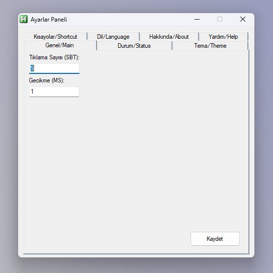

  <a href="README.en.md">🇺🇸 English</a> |
  <a href="https://github.com/MeNOTby1/Tarrow">🇹🇷 Türkçe</a>

# Tarrow

**Tarrow** is a lightweight, portable and customizable auto-clicker developed with AutoHotkey. It is compiled as a `.exe` and does not require the installation of AutoHotkey.
## 📌 Version History 

| Version | Date | Notes |
|-------------|----------------|------------------------------------|
| [v1.0.0 ALPHA](https://github.com/MeNOTby1/Tarrow/releases/tag/v1.0.0-alpha) | June 24, 2025 | First alpha version released. Added main features. |
| [v1.0.1 pre-BETA](https://github.com/MeNOTby1/Tarrow/releases/tag/v1.0.1-pre-beta) | June 25, 2025 | Fixed annoying bugs |
| [v1.0.2 pre-BETA](https://github.com/MeNOTby1/Tarrow/releases/tag/v1.0.2-pre-BETA) | June 26, 2025 | Added **startup** setting |
| [v1.0.3 pre-BETA](https://github.com/MeNOTby1/Tarrow/releases/tag/v1.0.3-pre-BETA) | June 27, 2025 | English language feature brought back |
| [v1.0.4 pre-BETA](https://github.com/MeNOTby1/Tarrow/releases/tag/v1.0.4-pre-BETA) | July 1, 2025 | Added **Notifications On / Off** setting |

>📜 [Read version history here](CHANGELOG.md)

---

## 🖼️ Screenshot `v1.0.0 alpha`

---

## ✨ Features

- Left and right click mode (independent on/off)
- Number of clicks and delay time can be adjusted
- Shortcut keys can be customized (example: F6, F7)
- Lightweight structure and simple interface
- Interface where you can get help
- Global hotkey feature

## 📜 Report Templates

If you have any issues, suggestions or questions, you can write them using these [`templates`](.github/ISSUE_TEMPLATE).

- [Issue ‼️](.github/ISSUE_TEMPLATE/bug_report.md)
- [Suggestion 💡](.github/ISSUE_TEMPLATE/feature_request.md)
- [Question 🤔](.github/ISSUE_TEMPLATE/question.md)

## 🖥️ How to Use?

1. Download [`Tarrow.exe`](https://github.com/MeNOTby1/Tarrow/tags).
2. **Create a folder and put the application inside it.**
This will ensure that the settings are saved properly and the application runs more stably.
3. Right click on [`Tarrow.exe`](https://github.com/MeNOTby1/Tarrow/tags) to create a shortcut on your desktop.
4. Double click to run it.
5. Right click on the icon in the system tray to open **Settings**.
6. Make the desired settings and click the "Save" button.
> ⚠ **Works even if AutoHotkey is not installed.** (Standalone `.exe`)

## 🔒 License

This software is for **personal** use only.

**Sharing**, **selling** or **modifying** without permission is prohibited.

**License:** [CC BY-NC-ND 4.0](https://creativecommons.org/licenses/by-nc-nd/4.0/)

**Copyright © 2025 MeNOTby1**

---
## ❓ Frequently Asked Questions (FAQ)

### 🔹 Why doesn't the app save settings?
You need to place the app in a folder and run it from there so that the settings can be written to the `settings.ini` file. Keep it in a folder instead of running it directly from the desktop.

### 🔹 The app won't open, only the icon appears?
The app runs in the background. You can open the settings panel by right-clicking on the icon in the system tray (next to the clock).

### 🔹 I changed the keys but it doesn't work?
After changing the settings, click the "Save" button. The new keys are active immediately. The previous keys are disabled.

### 🔹 I don't have AutoHotkey installed, will it still work?
Yes! The app is compiled as `.exe` and doesn't need AutoHotkey.

### 🔹 Is this a cheat?
Technically yes, but it wasn't designed to be a cheat. It was made for `Youtubers` who don't have the skills.
> (Like me 😢)

### 🔹 Is there a chance of getting banned/kicked?
Yes, but if you lower the settings or join the pro servers, you won't get banned.

## ✍️ Developer

**MeNOTby1**
"Thanks and enjoy!"
